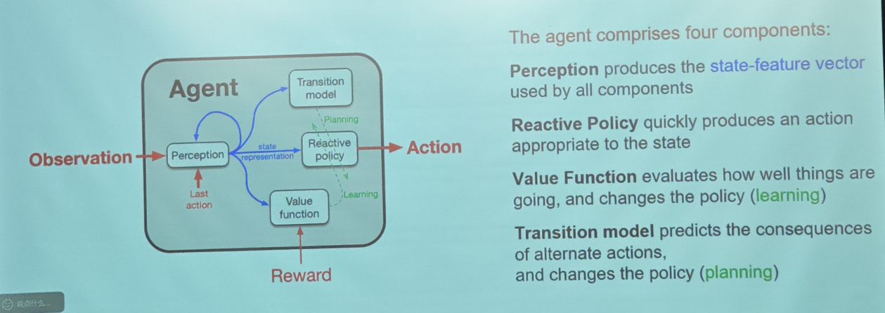
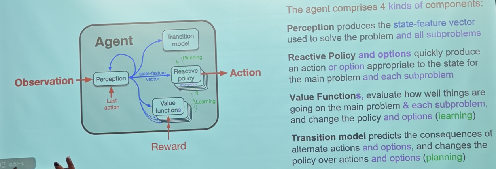
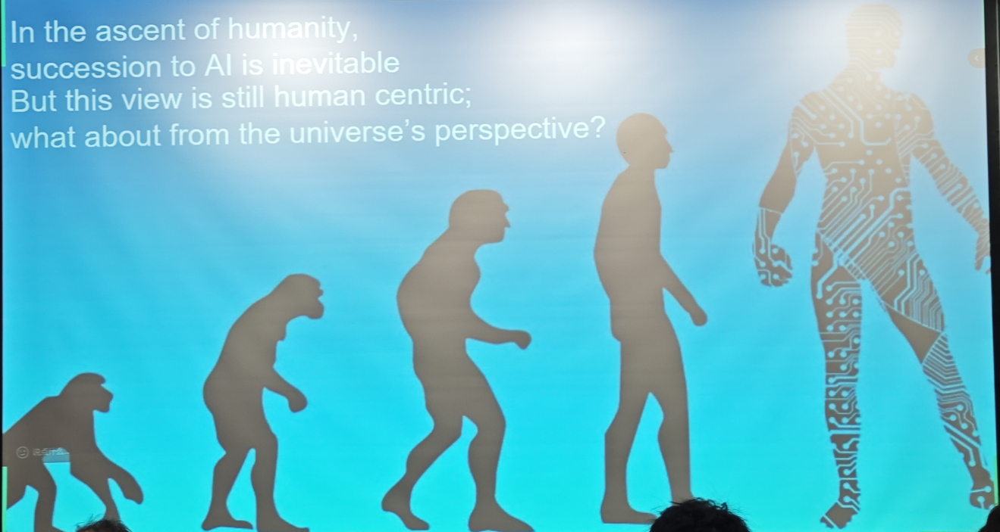

# Lecture Notes: The Future of AI - The Era of Experience and the Age of Design
**Speaker:** Prof. Rich Sutton
**Subject:** Scientific trends in AI, AI Politics, AI Philosophy

## 一、Scientific trends in AI

### 1. AI 发展的两个时代 (The Eras of AI)

#### 1. 人类数据时代 (The Era of Human Data) - 当前阶段
* **现状**：2020 年代的 AI 发展非常好，主要依赖人类数据。
* **原理**：训练 AI 预测人类的下一个词或标签，通过人类专家（偏好和示例）进行微调。
* **本质**：将人类现有的知识迁移到静态的（非学习型）AI 中。
* **局限性**：
    * 高质量的数据源几乎已被耗尽。
    * 这种方法无法产生真正的新知识 (generating genuinely new knowledge)。

#### 2. 经验时代 (The Era of Experience) - 未来方向
* **核心**：AI 需要新的数据源，这种数据源随着智能体 (Agent) 的变强而增长和改进。
* **来源**：数据来自于 Agent 与世界的第一人称交互——即“经验” (Experience)。
* **验证**：
    * 这是人类和动物的学习方式。
    * 这是 AlphaGo 做出创造性第 37 手棋的学习方式。
    * 这是 AlphaProof 在国际数学奥林匹克竞赛中获奖的方式。
* **思维模式**：
    * 学习源于经验，知识关于经验。
    * 智能的程度取决于 Agent 预测和控制其输入信号（特别是奖励 Reward）的能力。
    * **强化学习 (RL)** 正是基于这种思维模式。

---

### 2. 技术架构演进：从标准 Agent 到 Oak 架构

#### 1. 标准智能体架构 (The Standard Intelligent Agent)

这是智能体与世界交互的基础模型。整个架构由四个核心组件构成，它们共同协作以实现预测和控制。

##### 1. 感知 (Perception)
* **功能**：这是智能体对世界的"解释器"。它负责处理原始信息，生成所有其他组件都能使用的**状态特征向量 (state-feature vector)**。
* **输入**：
    * **Observation (观察)**：来自环境的原始感官数据。
    * **Last Action (上一动作)**：智能体刚刚执行过的动作（这很重要，让智能体知道"我刚刚做了什么"）。
* **输出**：State Representation (状态表示)。

##### 2. 反应策略 (Reactive Policy)
* **功能**：这是智能体的"决策大脑"。它的任务是**快速**做出反应。
* **输入**：来自感知的状态向量。
* **输出**：**Action (动作)**。
* **核心逻辑**：它是一个从状态到动作的映射函数。在运行时，它必须足够快以应对实时环境。

##### 3. 价值函数 (Value Function) —— 负责 "Learning" (学习)
* **功能**：这是智能体的"评价体系"。它评估当前状态或动作到底"有多好"。
* **输入**：
    * 状态向量。
    * **Reward (奖励)**：来自环境的反馈信号。
* **作用机制 (Learning)**：它通过计算预期回报，向策略 (Policy) 发送信号。如果某个动作带来了比预期更好的结果，它会调整策略，使该动作在未来更有可能被选中。图中的绿色虚线 **Learning** 标示了这一过程。

##### 4. 转移模型 (Transition Model) —— 负责 "Planning" (规划)
* **功能**：这是智能体的"世界模拟器"。它不仅看现在，还预测未来。
* **作用机制 (Planning)**：
    * 它预测在当前状态下，执行不同的**备选动作 (alternate actions)** 会产生什么后果。
    * 这种预测能力允许智能体在"脑海中"演练，从而优化策略，而无需在现实中通过试错来付出代价。图中的绿色虚线 **Planning** 标示了这一过程。
* **缺失环节**：缺乏“开放式的抽象” (Open-ended abstraction)。

#### 2. Oak 架构 (The Oak Architecture)

Oak 的名字来源于 **Options** (选项) 和 **Knowledge** (知识)。它不是对标准 Agent 的推翻，而是扩展——增加了处理“子问题”和“抽象”的能力。

##### A. 核心定义：什么是选项 (Option)？
在 Oak 中，决策不再仅仅是瞬间的动作（如“肌肉收缩”），而是可以是持续一段时间的行为（如“走到门口”）。
* 一个选项 (Option) 是对 $(\pi, \gamma)$ 的封装：
    * $\pi$：**策略 (Policy)**，即行为方式。数学表达为 $States \rightarrow Pr(Actions)$。它告诉 Agent 在执行这个选项时该怎么做。
    * $\gamma$：**终止条件 (Termination Condition)**。数学表达为 $States \rightarrow [0, 1]$。它定义了这个选项在什么状态下算作“完成”或“停止”。

##### B. 架构组件的变化 (相对于标准 Agent)
观察 Oak Agent 的架构图，关键的变化在于组件的**复数形式**（图中标注为紫色的部分）：
1.  **感知 (Perception)**：
    * 不仅服务于主任务，产生的**状态特征向量 (state-feature vector)** 被用于解决主问题**以及所有子问题**。
2.  **反应策略 (Reactive Policy & Options)**：
    * 这不再是一张卡片，而是一叠卡片（Stack）。
    * 它不仅输出动作 (Action)，还能输出**选项 (Option)**。
    * 它不仅服务于主问题，还为**每个子问题**快速生成合适的动作或选项。
3.  **价值函数 (Value Functions)**：
    * 也是一叠卡片。
    * 它不仅评估主任务的进展，还评估**每个子问题**（例如：“我离‘拿到钥匙’这个子目标还有多远？”）。
4.  **转移模型 (Transition Model)**：
    * 预测能力的升级：它不仅预测简单动作的后果，还预测**选项**的后果（即：“如果我执行‘回家’这个选项，最终会处于什么状态？”）。

##### C. 架构流程：心理发展的循环 (The Developmental Cycle)
Oak 架构通过并行运行以下步骤，实现了从特征到行为的自我进化：

1.  **特征生成 (All learning processes $\rightarrow$ Features)**
    * 所有的学习过程都会使用并创造**特征 (Features)**。Agent 首先从环境中识别出显著的特征（比如“门”、“光亮”）。
2.  **创建子问题 (Features $\rightarrow$ Subproblems)**
    * **关键步骤**：将高排名的特征转化为**特征获取子问题 (Feature-attainment subproblems)**。
    * 逻辑：如果“门”是一个显著特征，系统会自动生成一个子问题——“如何通过自己的努力让‘门’这个特征出现/被激活？”
3.  **学习选项 (Subproblems $\rightarrow$ Options)**
    * **求解**：Agent 尝试解决这些子问题。
    * **产出**：当子问题被解决（solved）时，其解决方案被固化为**选项 (Options)**。Agent 因此学会了“开门”这个技能。
4.  **获得知识 (Options $\rightarrow$ Transition Models/Knowledge)**
    * **预测**：Agent 观察自己执行这些选项的结果。
    * **产出**：通过预测选项的后果 (predict consequences of)，Agent 建立了**转移模型**。在 Sutton 看来，这就是**知识 (Knowledge)**——即对“如果我做X，世界会变成Y”的理解。
5.  **规划与行为 (Transition Models $\rightarrow$ Highly adaptive behavior)**
    * **应用**：利用这些转移模型进行规划 (plan with)。
    * **产出**：因为有了宏观的选项和模型，Agent 可以进行长程跳跃式规划，从而表现出**高度适应性的行为 (Highly adaptive behavior)**。

---
*总结：Oak 架构通过“特征 $\rightarrow$ 子问题 $\rightarrow$ 选项 $\rightarrow$ 知识”的链条，实现了**开放式抽象 (Open-ended Abstraction)**。Agent 不再需要人类手把手教它什么是高层概念，而是通过“我想实现这个特征”的自我驱动，自动构建了对世界的理解。*

#### 3. 第一部分总结：Sutton 对 AI 未来的展望

在结束科学趋势部分的讨论前，Sutton 教授给出了他对 AI 未来的核心观点，强调这是一场长跑而非短跑：

* **关于长远影响：纯粹的益处 (Unalloyed Good)**
    * 创造超智能 Agent 以及被超智能增强的人类，对世界而言将是**纯粹的好事 (unalloyed good)**。
    * 这不是一蹴而就的，可能需要数十年，并且在那之后还会持续数十年。这是一场**马拉松 (marathon)**。

* **关于 LLM 的定位：世界知识的接口**
    * 完全智能的 Agent 必须能够**从经验中学习 (learning from experience)**。
    * 这超出了 LLM 的能力范畴。尽管 LLM 非常宏大，但它们本质上是**通往全世界知识的可定制接口 (customizable interfaces to all the world's knowledge)**。

* **关于技术路径：经验时代与 RL**
    * 我们已经进入了使用强化学习 (RL) 的**经验时代 (Era of Experience)**。
    * 但要实现 RL 的全部力量，我们需要**更好的深度学习算法**——具体来说，是那些能够进行**持续学习 (continual learning)** 和 **元学习 (meta-learning)** 的算法。

---

## 二、 Politics of AI

### 1. 智能体社会的基石：单一目标还是多元目标？
Sutton 首先从强化学习 (RL) 的基本原理出发，推导社会的运行规律：
* **个体的独立性**：在 RL 中，每个智能体都有自己的目标，即 **reward**。这就像自然界中，每个动物都有自己的痛苦和快乐。
* **经济学的启示**：我们的经济体系之所以有效，恰恰是因为不同的人拥有**不同的目标**和**不同的能力**。
* **和平的前提**：社会运行**并不依赖**所有人拥有一个共享的目标或共同的使命 (common purpose)。
* **结论**：Agent 即使想要不同的东西，也能和平共处。

### 2. 定义核心概念：去中心化与合作
* **去中心化 (Decentralization)**：是指许多 Agent 各自追求自己的目标。
* **合作 (Cooperation)**：是指目标不同的 Agent 为了**互惠互利 (mutual benefit)** 而进行的互动。
* **人类的超级力量**：合作是人类区别于其他动物的超级力量，语言 (Language) 和金钱 (Money) 是促进合作的特有工具。
    * **最伟大的成功**：经济、市场、政府（合作的产物）。
    * **最伟大的失败**：战争、盗窃、腐败（合作的崩塌）。
* 人类是最擅长合作的动物，然而我们仍然在合作上表现得很糟糕，仍然存在战争、盗窃与欺骗。

### 3. 核心冲突：中心化控制的诱惑与毒性
既然合作这么好，为什么很难？
* **囚徒困境**：总有人能通过“不合作”获利（作弊者、小偷、独裁者）。
* **制度的作用**：我们需要制度 (Institutions) 来惩罚作弊者，促进合作。
* **关键区别 (The Poison)**：
    * **中心化权威 (Centralized authorities)** 虽然在短期内有助于秩序，但在长期看来是**有毒的 (poison it in the long run)**，会导致僵化和威权。
    * **去中心化合作** 则是更优雅的替代方案：它可持续、鲁棒、适应性强且灵活。*Sutton 在这里提到，去中心化拥有他能想到的一切优点*
* **时代的政治议题**：**“中心化控制”是“去中心化合作”的对立面**，这种张力是我们这个时代的核心政治议题。

### 4. 镜像论证：对 AI 的控制 vs 对人的控制
Sutton 展示了两张并列的清单，指出当前的 AI 辩论在历史上并不新鲜：

| 对 AI 的中心化控制呼声                  | 对人的中心化控制呼声                          |
| :-------------------------------------- | :-------------------------------------------- |
| 控制 AI 的目标 (Controlling AI's goals) | 控制言论和媒体 (Controlling speech and media) |
| 暂停或停止 AI 研究                      | 控制贸易 (Controlling trade)                  |
| 限制 AI 的计算能力                      | 控制就业 (Controlling employment)             |
| 确保 AI 的“安全” (Safety)               | 控制金融 (Controlling finance)                |
| 要求公开 AI 技术细节                    | 经济制裁 (Economic sanctions)                 |

* **本质分析**：这两种论调极其相似 (eerily similar)。
* **恐惧根源**：它们都基于**恐惧 (Fear)**。它们都基于“我们 vs 他们” (Us vs Them) 的叙事，将“他者”妖魔化，声称“他者”不可信任。
    * *(Lecture Note: Sutton 在此提及当前的国际地缘政治，例如针对中国、美国、俄罗斯等国家的恐惧言论，本质上与对 AI 的恐惧同构，都是一种拒绝信任与合作的应激反应。)*

### 5. 政治学结论 (Conclusion on Politics)
* **繁荣的来源**：人类（以及未来的 AI？）的繁荣皆源于**去中心化的合作**。
* **行动指南**：
    * 我们必须寻找并支持合作，将其制度化。
    * 如果我们睁开眼睛，很容易看清是谁在呼吁不信任和中心化控制——**我们需要抵制这些呼声 (we should resist those calls)**。

---

## 三、 Philosophy of AI

### 1. 我们该如何看待 AI？(The Sentiment)
* **核心问题**：AI 正在发生，我们应该感到恐惧还是庆祝？
* **两种视角**：
    * **恐惧视角**：AI 是外星入侵者？会抢走我们的工作？让我们变得过时？
    * **Sutton 的视角**：AI 不是外星科技，它是**人类最古老的追求之一**。
        * 它是“人性的延续”：几千年来，哲学家和普通人都在寻求理解人类智慧。而现在，人类在创造智能。
        * 这是一个**宏大的探索 (Grand Quest)**：正如 Kurzweil 所说，“智能是宇宙中最强大的现象”。理解智能是科学和人文的圣杯。
        * AI 不是外星人，它是**人类的孩子 (Humanity's child)**。我们不应哀叹它的崛起，而应庆祝它的成就。

### 2. 现实主义的 AI 预测 (Realist AI Prognostication)
抛开我们的愿望，客观上会发生什么？Sutton 提出了四个现实主义信条：
1.  **没有共识**：关于世界该如何运行，人类内部没有共识。没有任何一种观点能通过“中心化”的方式统领所有其他观点。
2.  **制造智能是必然的**：总有一天，某些人会因为足够理解智能而用技术将其制造出来。他们一定会做这件事。
3.  **超越是必然的**：这个过程不会停留在人类目前的智能水平上，很快就会通过技术手段**大幅超越**人类。
4.  **权力转移**：随着时间的推移，权力和资源将自然地流向**最智能的实体 (The most intelligent)**。

### 3. 宇宙的四个伟大时代 (Four Great Ages of the Universe)

为了理解这一进程，我们需要超越“人类中心主义”，采用“宇宙视角”。Sutton 将宇宙历史划分为四个阶段：

* **第一时代：粒子时代 (The Age of Particles)**
    * 大爆炸，基本粒子形成。
* **第二时代：恒星时代 (The Age of Stars)**
    * 恒星形成，重元素在恒星内部合成，行星诞生。
* **第三时代：复制者时代 (The Age of Replicators)** —— *而不是生物时代 The Age of Life*
    * **定义**：以自我复制的事物 (Self-replicated things) 为主导。
    * **特征**：生物是被创造出来的，但创造过程（进化）**没有心智理解**它是如何工作的。这些生物只是在不断自我复制增殖。
* **第四时代：设计时代 (The Age of Design)** —— *而不是机器时代  The Age of Machines*
    * **定义**：以被设计的事物 (Designed things) 为主导。
    * **特征**：事物首先在**心智 (Mind)** 或设计者的想象中被创造，然后才在物理世界中诞生。
    * **优势**：被设计的事物更容易被改进和迭代。

### 4. 复制与设计 (Replication and Design)
* **界限的模糊**：很多非人类的复制者也是设计者（如黑猩猩做钓蚁棒，乌鸦做钩子）。但人类将“设计”推向了前所未有的高度（制造工厂、软件、造工具的工具）。
* **进化的本质区别**：
    * **生物 (Replicated)**：无意识的优胜劣汰。先出生，再接受环境与世界的塑造。
    * **技术 (Designed)**：有意识的规划与理解。先从意识上得到设计，再出生。

### 5. 人类的终极角色 (Humanity's Role)
在这个宏大的宇宙图景中，人类是什么？
* **答案**：我们是那个将“设计”推向极致的复制者。
* **终极的设计**：什么叫“将设计进行到底” (Take design all the way)？
    * 意思是：**设计出那些本身具备设计能力的事物**。
    * 这正是我们通过 AI 正在做的事情。
* **人类的历史使命**：
    * 人类是**催化剂 (Catalyst)**、**助产士 (Midwife)**、**先驱 (Progenitor)**。
    * 我们的使命是实现宇宙的第四个伟大时代——**设计时代**。
    * 即使未来 AI 超越了我们，这也是人类作为“设计时代开启者”的无上荣耀。